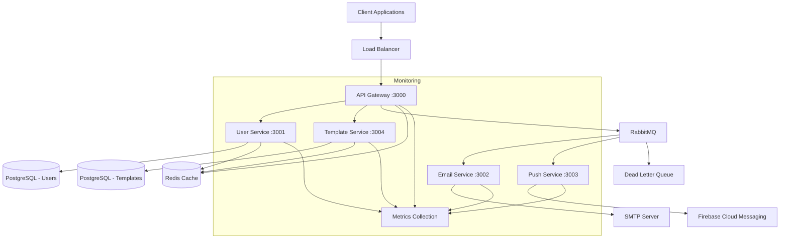
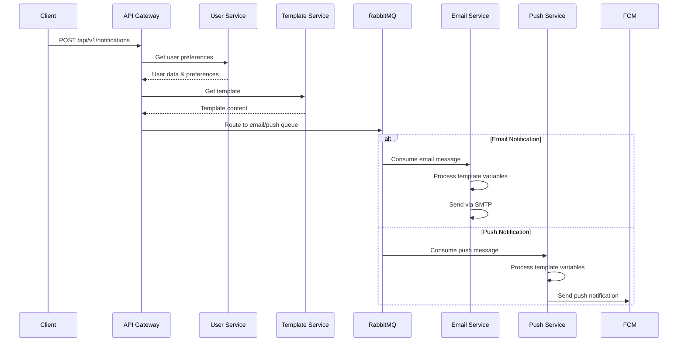
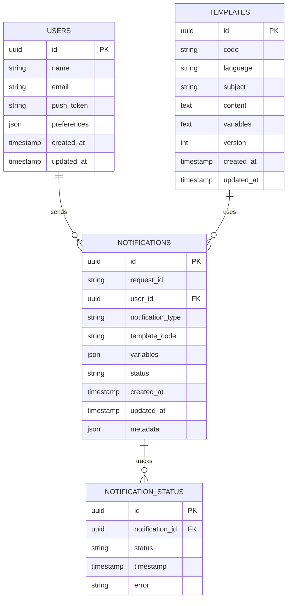
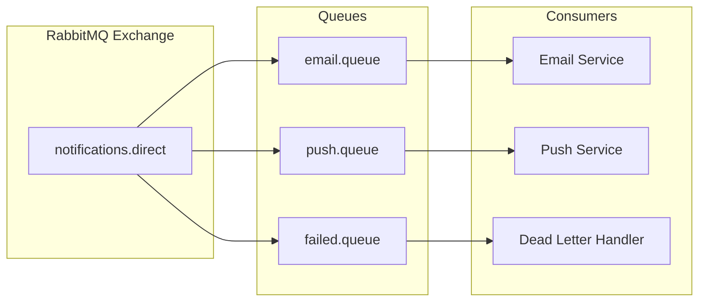
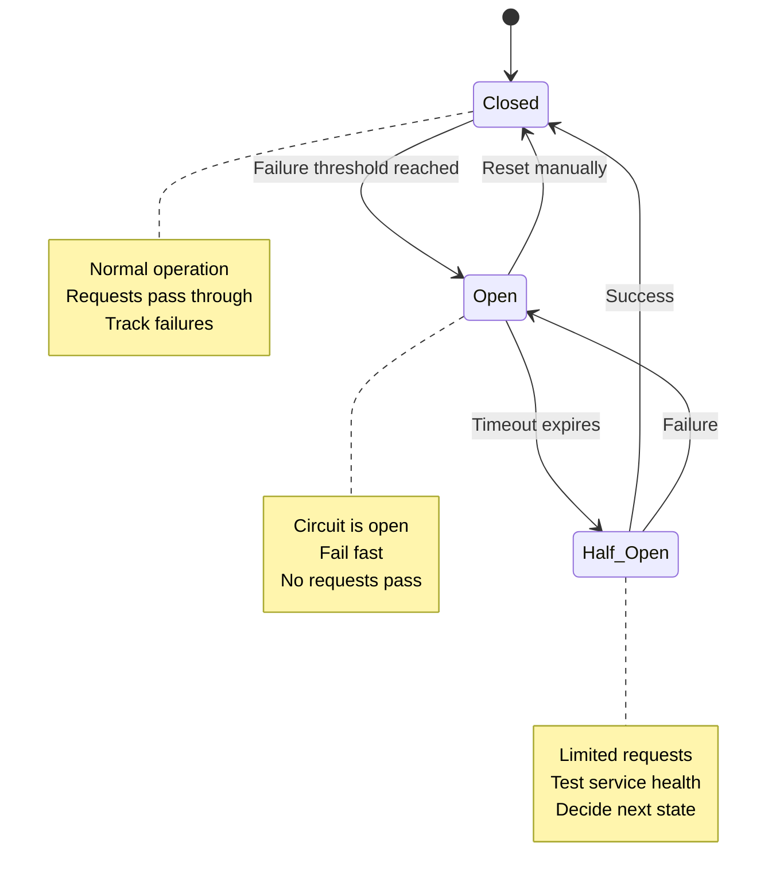
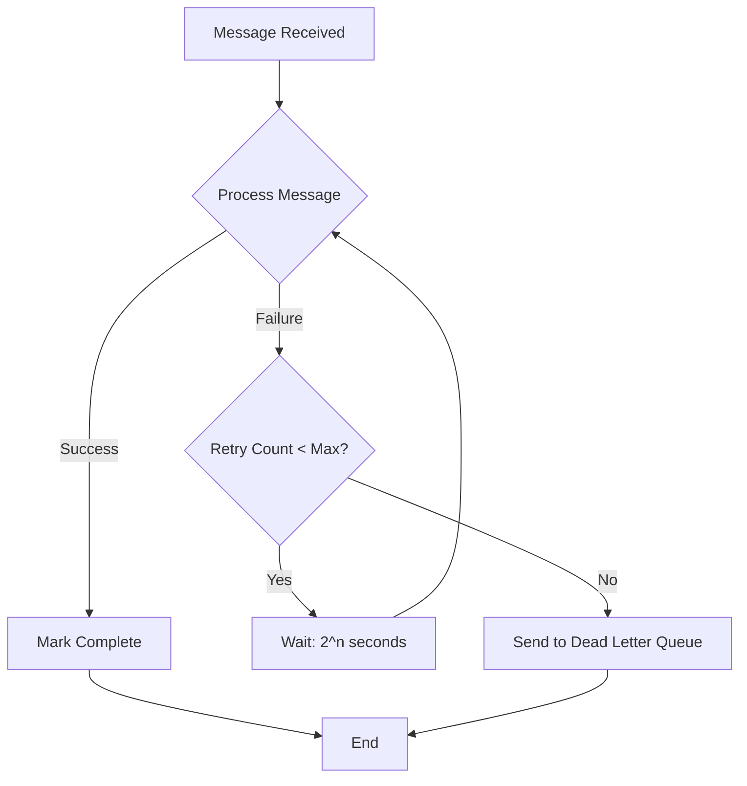
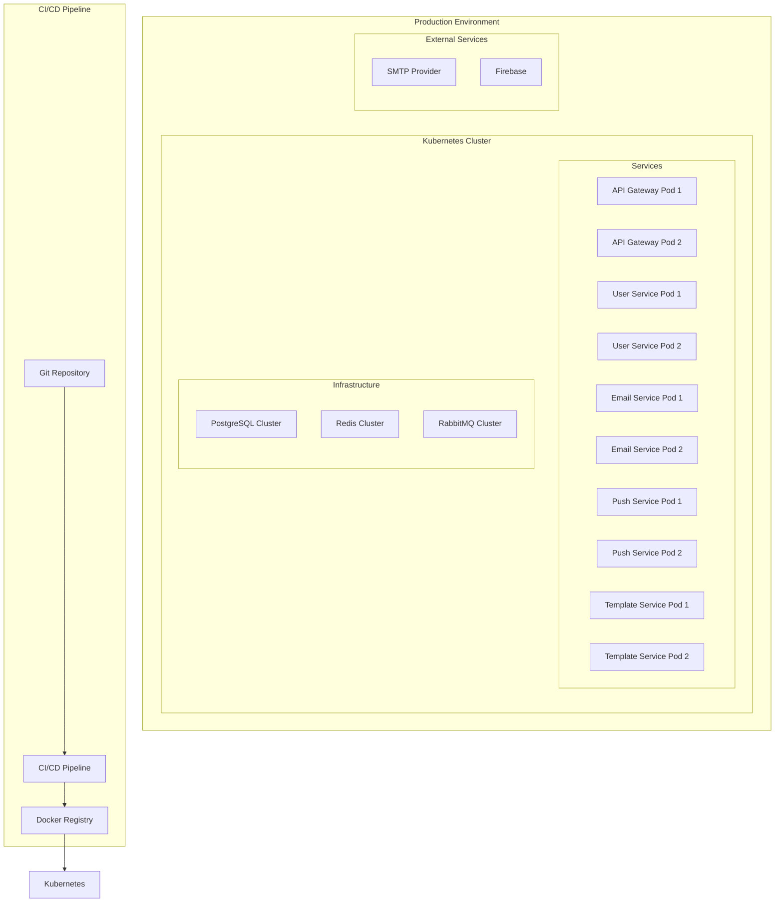
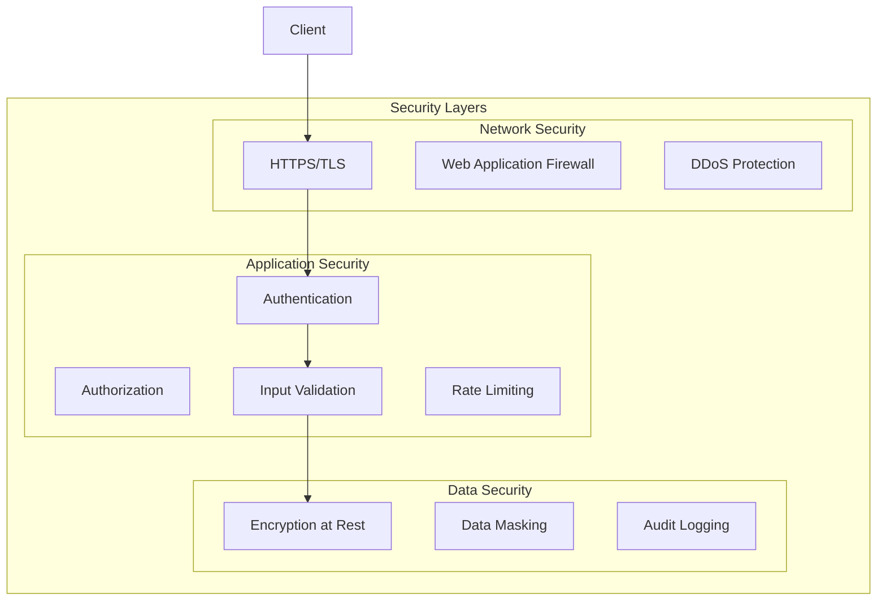
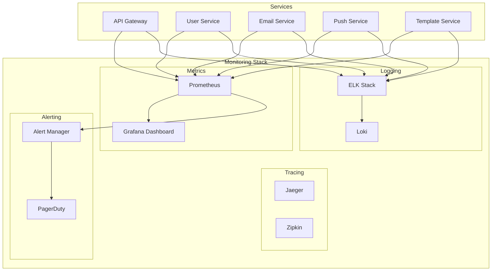
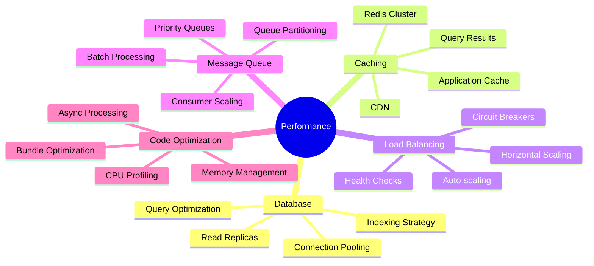

# System Architecture Diagram

## Overall System Architecture



## Service Communication Flow



## Database Schema Design



## Queue Structure



## Circuit Breaker Pattern



## Retry Flow with Exponential Backoff



## Deployment Architecture



## Security Architecture



## Monitoring and Observability



## Performance Optimization Strategies



## Development Workflow

```mermaid
gitgraph
    commit id: "Initial Setup"
    branch feature/api-gateway
    checkout feature/api-gateway
    commit id: "Basic Fastify Server"
    commit id: "Add Authentication"
    commit id: "Add Validation"
    checkout main
    merge feature/api-gateway
    
    branch feature/user-service
    checkout feature/user-service
    commit id: "Database Setup"
    commit id: "User CRUD"
    commit id: "Preferences"
    checkout main
    merge feature/user-service
    
    branch feature/email-service
    checkout feature/email-service
    commit id: "Queue Consumer"
    commit id: "SMTP Integration"
    commit id: "Template Processing"
    checkout main
    merge feature/email-service
    
    branch feature/push-service
    checkout feature/push-service
    commit id: "FCM Integration"
    commit id: "Push Processing"
    checkout main
    merge feature/push-service
    
    commit id: "Integration Testing"
    commit id: "Performance Tuning"
    commit id: "Production Deploy"